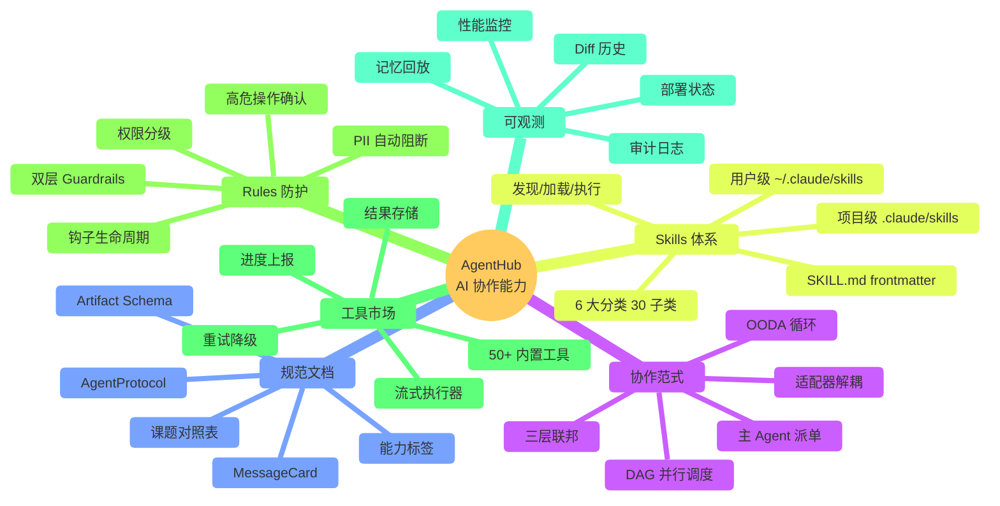
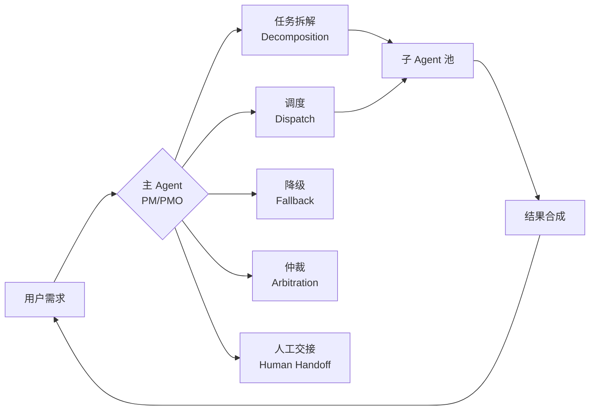
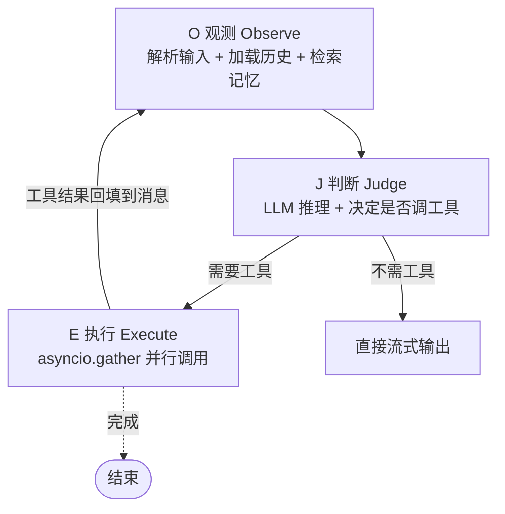
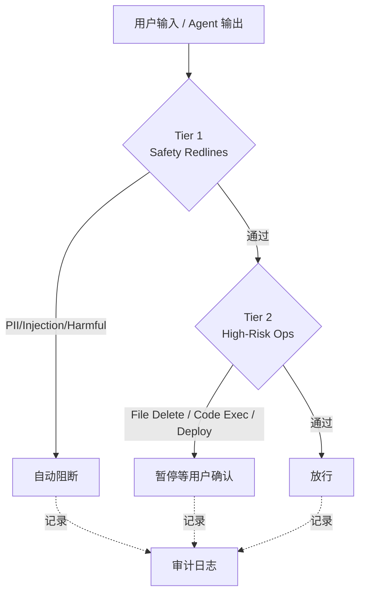

# AgentHub AI 协作能力总结


## 0. 一句话定义

> **AgentHub 不是"调用 LLM 的工具"，而是"一支可被指挥、可被观测、可被审计的 AI 团队"。**
>
> 它把"单点 LLM 调用"升级为"多角色协作范式 + 规范契约 + 工具市场 + 防护规则"的完整工程化体系。

---

## 1. AI 协作能力全景图



---

## 2. 协作范式（Collaboration Paradigm）

### 2.1 6 大核心范式

| # | 范式 | 一句话描述 | 落地位置 |
|---|---|---|---|
| 1 | **主 Agent 派单（PM/PMO）** | 一个全局 Orchestrator 把用户意图拆给子 Agent | `agent_service.py` + §2.2 |
| 2 | **DAG 并行调度** | 拆出的子任务按依赖关系并行/串行执行 | `dag_executor.py` |
| 3 | **适配器解耦** | 多个 LLM 厂商（Claude/Codex/OpenClaw）通过统一接口接入 | `protocols/base.py` + `adapters/*` |
| 4 | **OODA 循环** | 单次 Agent 调用内部遵循 观测→判断→执行 闭环 | `frontend/public/charts/02-ooda-workflow.md` |
| 5 | **三层联邦架构** | 元调度 / 领域主 Agent / 微子 Agent 分层协作 | §2.4 |
| 6 | **LangGraph 工作流** | 用 LangGraph 表达 Agent 间的状态转移 | `langgraph_workflow.py` |

### 2.2 主 Agent 派单（PM/PMO 角色化）

把 Orchestrator 升格为**产品级主 Agent**（类比 PM/PMO），5 大能力：



| 能力 | 触发场景 | 关键产出 |
|---|---|---|
| **任务拆解** | 用户发来复杂需求 | DAG 拓扑 + 节点风险等级 |
| **调度** | 拆解完成后 | 串行/并行/重试策略 |
| **降级** | 主/子 Agent 失败 | 备用 Agent → 规则引擎 → 用户接管 |
| **仲裁** | 多 Agent 输出冲突 | Symbolic 仲裁消息 |
| **人工交接** | 风险 ≥ L3 / 置信度 < 0.6 | 弹窗给用户 3 选 1 |

### 2.3 DAG 并行调度

任务被拆为 DAG 后，**自研 Executor**（不引入 Airflow）执行：

```
                ┌→ [子任务 A: 写 models] ─┐
[任务入口] ─→ 拆 │                          ├→ [结果合成] → 输出
                └→ [子任务 B: 写 tests] ─┘
                （asyncio.gather 并行）
```

- 节点级**重试 + 超时 + 降级**
- 与 `file_lock.py` 联动防止并发写同一文件
- 与 WebSocket 联动实时推送 DAG 进度

### 2.4 适配器解耦（多 LLM 厂商）

```python
# app/services/protocols/base.py
class SubprocessProtocol:
    adapter_type: str = ""                       # 厂商标识
    def supports_interactive(self) -> bool: ...  # 是否支持双向 JSONL
    def encode_user_message(self, ...) -> str: ...# 用户消息编码
    def encode_tool_result(self, ...) -> str: ... # 工具结果回传
    def extract_session_id(self, ...) -> str: ...# 会话 ID 抽取
```

**4 个具体实现**：

| Adapter | 平台 | 场景 |
|---|---|---|
| `CloudCodeAdapter` | Anthropic Messages API | 主力编码 Agent |
| `LocalClaudeAdapter` | 本地 Claude Code CLI | 离线 / 降级 |
| `LocalCodexAdapter` | 本地 Codex CLI | 备选 |
| `LocalOpenClawAdapter` | 本地 OpenClaw | 自建 Agent 接入 |

### 2.5 OODA 循环（单次调用的内在节奏）



**原子性保证**：每一步都可被审计、可被中断、可被回放。

### 2.6 三层联邦架构

```
┌─────────────────────────────────────────────┐
│  元调度层：Orchestrator (主 Agent / PMO)     │
├─────────────────────────────────────────────┤
│  领域主 Agent：Architect / CodeGen /        │
│              Review / Test / Deploy         │
├─────────────────────────────────────────────┤
│  微子 Agent：单任务工具调用                  │
└─────────────────────────────────────────────┘
```

---

## 3. 规范文档（Spec Documents）

### 3.1 Spec 体系清单

项目内**正式 Spec 文档** 共 4 类：

| Spec | 文件 | 作用 |
|---|---|---|
| **AgentProtocol** | `app/schemas/agent_protocol.py` | 统一 Agent 接入契约 |
| **Artifact Schema** | `app/schemas/artifact.py` | 产物统一抽象 |
| **MessageCard Schema** | `app/schemas/message_card.py` | 消息类型规范 |
| **DAG Schema** | `app/schemas/dag.py` | 任务图契约 |
| **Common Schema** | `app/schemas/common.py` | 通用响应/分页 |

### 3.2 AgentProtocol（Agent 接入规范）

```python
class AgentProtocol(BaseModel):
    agent_id: str                    # 全局唯一
    name: str                        # UI 显示名
    avatar: str                      # 头像资源路径
    role_tag: str                    # "CodeGen" | "Review" | ...
    capabilities: list[str]          # ["code_generation", "diff_review", ...]
    platform: Literal["cloudcode", "codex", "opencode", "custom"]
    model_name: str                  # 平台内的模型名
    system_prompt: str               # 必含 5 段：身份/拆解/调度/降级/仲裁
    tools: list[str] = []            # 可调用的工具
    risk_level: Literal["L1", "L2", "L3", "L4"] = "L1"
    is_builtin: bool = False
    is_active: bool = True
    config: dict = {}                # 平台特定配置
```

**8 大能力标签**（主 Agent 按此路由）：

| 能力 | 标签值 | 触发场景 |
|---|---|---|
| 任务拆解 | `task_decomposition` | 主 Agent 派单 |
| 代码生成 | `code_generation` | @CodeGen |
| Diff 审查 | `diff_review` | @Review |
| 测试执行 | `test_execution` | @Test |
| 部署 | `deployment` | @Deploy |
| 文档写作 | `doc_writing` | @Docs |
| 段落引用 | `chunk_citation` | 用户引用文档段落 |
| 产物预览 | `artifact_preview` | 自动 |

### 3.3 Artifact Schema（产物规范）

把"网页/文档/PPT/代码"四类产物**统一抽象**：

```python
class Artifact(BaseModel):
    artifact_id: str
    session_id: str
    task_id: str
    type: Literal["webpage", "document", "ppt", "code", "diff"]
    title: str
    content: str | dict              # 内容（HTML/Markdown/PPTX-JSON/代码）
    chunks: list[Chunk] = []         # 段落级引用单元
    version: int = 1
    parent_artifact_id: str | None = None
    created_at: str
    created_by: str                  # agent_id 或 user_id

class Chunk(BaseModel):
    chunk_id: str                    # "c-1", "c-2" ...
    text: str                        # 段落文本
    offset: int                      # 字符偏移
    length: int
    metadata: dict = {}
```

**核心创新**：`{{artifact:art-7:c-3}}` 段落级引用语法 → 用户可"喂"任意段落给 Agent。

### 3.4 MessageCard Schema（消息类型规范）

10 种消息类型，统一为结构化卡片：

```python
class MessageCard(BaseModel):
    card_id: str
    type: Literal[
        "text", "code", "diff", "preview", "deploy_status",
        "task_update", "audit", "artifact", "dag_progress", "system"
    ]
    title: str
    body: str | dict
    actions: list[CardAction] = []    # 按钮列表
    status: Literal["pending", "running", "success", "failed"] | None = None
    metadata: dict = {}
    timestamp: str
```

| type | 用途 | 新增版本 |
|---|---|---|
| text | 普通文本 | v3.1 |
| code | 代码展示 | v3.1 |
| diff | Diff 展示 | v3.1 |
| preview | 预览 URL | v3.1 |
| **deploy_status** | 部署状态卡片 | **v3.2** |
| task_update | 任务状态更新 | v3.1 |
| audit | 审计提示 | v3.1 |
| **artifact** | 产物卡片 | **v3.2** |
| **dag_progress** | DAG 进度图 | **v3.2** |
| system | 系统通知 | v3.1 |

### 3.5 课题需求对照表（重要交付物）

| 编号 | 课题原文 | v3.2 落地章节 | 代码模块 | 完成度 |
|---|---|---|---|---|
| R1.1 | 对话列表 | §6.1 | `SessionSidebar.tsx` | 100% |
| R1.2 | 单聊模式 | §6.2 | `agent_service.py:invoke_agent` | 100% |
| R1.3 | 群聊模式 | §6.3 | `chat/group_router.py` | 70% |
| R1.4 | 消息类型（部署卡片） | §7 | `message_card.py` | 100% |
| R1.5 | 产物预览/编辑 | §4 | `FilePreviewPanel.tsx` | 80% |
| R1.6 | 三方部署 | §11 | `codegen_service.py` | 100% |
| R2.1 | 主 Agent 类比 PM | §2 | `agent_service.py:Orchestrator` | 100% |
| R2.2 | 任务拆解 | §2.3 | `langgraph_workflow.py` | 100% |
| R2.3 | 调度/降级 | §2.4 | `agent_service.py:choose_models` | 100% |
| R2.4 | 代码冲突 | §2.5 | `task_state_machine.py` | 100% |
| R3.1 | 接入 Cloud Code/Codex/Open Code | §3.1 | `adapters/*` | 50% |
| R3.2 | 自建 Agent | §3.2 | `api/admin/roles.py` | 100% |
| R3.3 | 头像/名称/能力标签 | §3.3 | `AgentCanvas.tsx` | 100% |
| R3.4 | 自建 Agent 入聊天列表 | §3.4 | `agent_registry` | 100% |
| R4.1 | 网页/文档/PPT/代码预览 | §4.2-4.5 | `artifact/*` | 70% |
| R4.2 | Diff 视图 | §4.6 | `DiffBubble.tsx` | 100% |
| R4.3 | 版本历史 | §4.7 | `api/canvas.py` | 100% |
| R4.4 | 段落引用 | §4.8 | `{{artifact:chunk:N}}` | 50% |
| R5.1 | Web/桌面/移动端 | §8 | Tauri 包装 | 70% |
| R5.2 | 多人协作 + 冲突 | §5 | `crdt.py` | 30% |

---

## 4. Skills 体系

### 4.1 体系结构

Skills 是 Agent 可调用的**外部能力包**，完全兼容 Claude Code 规范：

```
~/.claude/skills/                  ← 用户级（跨项目共享）
└── anysearch/
    ├── SKILL.md                   # YAML frontmatter + 文档
    ├── scripts/                   # 可执行脚本
    │   ├── search.py
    │   └── crawl.py
    └── .env / .env.example        # API 密钥

.claude/skills/                    ← 项目级（项目专属，优先级更高）
└── deploy/
    ├── SKILL.md
    └── scripts/deploy_vercel.py
```

**优先级**：项目级 > 用户级（同名前者覆盖后者）。

### 4.2 SKILL.md 规范

```yaml
---
name: anysearch
description: 实时联网搜索，支持 6+ 搜索引擎
version: 1.0.0
category: 工具集成              # 一级分类（用于 _classify_skill）
tags: [api, http, integration]  # 二级标签
---

# AnySearch 使用文档
...
```

**前端解析器**（`app/api/skills.py`）支持：
- 简单 `key: value`
- 多行缩进值
- 管道风格 `|`
- 折叠风格 `>`
- 列表项 `-`

### 4.3 6 大分类 30 子类

| 一级分类 | 子分类数 | 代表 Skill |
|---|---|---|
| **工具集成** | 5 | API/HTTP、数据库、浏览器、本地命令、云服务 |
| **决策规划** | 5 | 任务拆解、流程编排、多轮推理、路由、反思纠错 |
| **交互感知** | 4 | 对话、文件解析、OCR、语音 |
| **数据处理** | 4 | 结构化、清洗、可视化、摘要 |
| **开发工程** | 4 | 代码生成、调试、Git、容器部署 |
| **业务场景** | 4 | 内容创作、办公自动化、会议协作、行业专项 |

### 4.4 三大工具操作

| 操作 | 工具名 | 作用 |
|---|---|---|
| 发现 | `skill_list` | 扫描所有 skills 目录，返回元信息 |
| 加载 | `skill_load` | 读取 SKILL.md 完整 body（截断 3 万字符） |
| 执行 | `command_execute` | 调用 skill 的 script 或任意 shell 命令 |

### 4.5 安全沙箱

- **超时保护**：`COMMAND_EXECUTE_TIMEOUT` 默认 30s
- **输出截断**：`COMMAND_EXECUTE_MAX_OUTPUT` 默认 50KB
- **权限挂钩**：先过 `PermissionManager` + `Guardrails` 再执行
- **审计日志**：所有 `command_execute` 写入 `audit_log` 表

---

## 5. Rules 防护体系

### 5.1 双层防护架构



**设计哲学**：「宁可给一个有瑕疵的答案，也不要什么都不给」→ 阻断只用于安全，不用在质量。

### 5.2 Tier 1：Safety Redlines（自动阻断）

11 类正则规则（`app/services/guardrails.py`）：

| 类别 | 规则数 | 示例 |
|---|---|---|
| **PII 检测** | 10 | SSN、信用卡、中国手机号、身份证、邮箱、IP、OpenAI/Key、GitHub Token、AWS Key、JWT |
| **Prompt 注入** | 6 | 忽略指令、角色切换、绕过安全、越狱、系统命令注入、SQL 注入 |
| **有害内容** | 4+ | 暴力、歧视、违法信息 |
| **高危操作** | 5+ | rm -rf、chmod 777、删库等 |

**PII 样例**（完整实现）：

```python
PII_PATTERNS = [
    ("pii_ssn",         r"\b\d{3}-\d{2}-\d{4}\b"),
    ("pii_credit_card", r"\b(?:\d{4}[-\s]?){3}\d{4}\b"),
    ("pii_phone_cn",    r"\b1[3-9]\d{9}\b"),
    ("pii_id_card_cn",  r"\b[1-9]\d{5}(?:19|20)\d{2}..."),
    ("pii_api_key_openai", r"\bsk-(?:proj-)?[A-Za-z0-9]{32,}\b"),
    # ... 共 10 条
]
```

### 5.3 Tier 2：高危操作确认

| 操作 | 风险等级 | 处理 |
|---|---|---|
| 文件读取 | L1 | 放行 |
| 文件写入 | L2 | 询问 |
| 文件删除 | L3 | **强确认** |
| Shell 执行 | L3 | **强确认 + 黑白名单** |
| 部署 | L4 | **强确认 + 项目级二次校验** |
| 支付相关 | L4 | **强确认 + 风控** |

### 5.4 权限分级（Permission Modes）

4 种会话级权限模式（`app/services/tools/permission.py`）：

| 模式 | 行为 | 适用场景 |
|---|---|---|
| `DEFAULT` | L2+ 工具需询问 | 日常协作 |
| `BYPASS` | 自动放行所有 | 管理员 / 批处理 |
| `AUTO` | 规则引擎自动决策 | 中度信任 Agent |
| `PLAN` | 只读，拒所有写/删/shell | 规划阶段 |

**决策流程**（`PermissionManager.check()`）：

```
1. 匹配 always_allow_rules → ALLOW
2. 匹配 always_deny_rules  → DENY
3. 匹配 always_ask_rules   → ASK
4. tool.requires_user_confirmation → ASK
5. L3 风险工具 + DEFAULT 模式 → ASK
6. fall through → ALLOW
```

### 5.5 钩子生命周期（Hooks）

`HookManager`（`app/services/tools/hooks.py`）支持 3 个作用域：

```python
# 注册全局钩子（所有工具触发）
hook_manager.register_pre(None, global_audit_hook)

# 注册分类钩子（某类工具触发）
hook_manager.register_pre("category:file", file_safety_hook)

# 注册具体工具钩子
hook_manager.register_pre("shell_exec", command_blacklist_hook)
```

**执行顺序**：global → category → per-tool，第一个 `blocked=True` 短路。

### 5.6 符号蒸馏协议（保真度软信号）

**v3.2 重要降级**（`app/services/symbolic.py`）：

```
v3.1:  < 0.55 → 硬阻断（UX 反噬）
v3.2:  < 0.55 → 仅 warn（不阻断）
       0.70-0.85 → warn
       ≥ 0.85 → pass
```

**理由**：
- 启发式算法跟语义质量弱相关
- 模型 fallback 文案必然低分，触发二次 block
- 工业级产品（Cursor、Devin）都没用硬阻断

---

## 6. 工具市场（Tool Marketplace）

### 6.1 50+ 内置工具分类

`app/services/tools/` 模块：

| 类别 | 文件 | 工具数 |
|---|---|---|
| 基础工具 | `builtin_tools.py` | 25+（web 搜索 6 个、文件、命令、HTTP） |
| 浏览器自动化 | `browser_tools.py` | 4（puppeteer、playwright） |
| 网络工具 | `network_tools.py` | 6（DNS、ping、whois） |
| Agent 工具 | `agent_tools.py` | 3（@、路由、切换） |
| Session 工具 | `session_tools.py` | 4（历史、回放、引用、收藏） |
| Skill 工具 | `skill_tools.py` | 3（list、load、execute） |

### 6.2 工具执行生命周期

```mermaid
flowchart LR
    A[Agent 请求 tool_call] --> B[PermissionManager.check]
    B --> C[HookManager.run_pre_hooks]
    C --> D[Guardrails.scan]
    D --> E[StreamingExecutor.execute]
    E --> F[ResultStorage.persist]
    F --> G[HookManager.run_post_hooks]
    G --> H[Progress.report to WS]
    H --> I[Result 回填到 Agent]
```



### 6.3 关键能力

- **流式执行器**（`streaming_executor.py`）：工具结果可流式回传
- **结果存储**（`result_storage.py`）：大结果落盘 + 引用
- **进度上报**（`progress.py`）：通过 WebSocket 实时推送工具执行进度
- **错误处理**（`errors.py`）：统一错误码 + 用户友好消息
- **重试降级**：瞬态错误自动重试 3 次（指数退避）

---

## 7. 可观测与审计

### 7.1 性能监控（`performance_monitor.py`）

12 类指标（`/api/metrics`）：

| 类别 | 指标 |
|---|---|
| 模型连接 | avg/p50/p95/p99 延迟、成功率、重试计数 |
| 流式输出 | TTFT（首 Token 延迟）、chunk 间隔 |
| WebSocket | 广播延迟、失败/超时计数 |
| 系统 | HTTP 重试总数、活跃降级数、运行时长 |

### 7.2 审计日志（`api/admin/audit.py`）

记录：
- 所有 tool 调用（参数哈希、结果摘要）
- 所有 Agent 决策（派单、降级、仲裁）
- 所有权限决策（allow/deny/ask + 原因）
- 所有 Skill 执行（命令、输出、退出码）

### 7.3 Diff 与历史

- `DiffBubble.tsx`：单文件行内 diff
- `DiffViewer.tsx`：多文件并排 diff
- 版本树：`GET /api/artifacts/{id}/versions`
- 恢复版本：`POST /api/artifacts/{id}/versions/{n}/restore`

### 7.4 记忆体系（`memory/*`）

7 个子模块：

| 文件 | 作用 |
|---|---|
| `models.py` | 记忆数据结构 |
| `storage.py` | 记忆持久化 |
| `extractor.py` | 从对话抽取记忆 |
| `scanner.py` | 工作区扫描生成上下文 |
| `consolidator.py` | 记忆合并/去重 |
| `session_memory.py` | 单会话短期记忆 |
| `session_store.py` | 会话存储管理 |

---

## 8. 多端适配

| 端 | 实现 | 复用度 |
|---|---|---|
| **Web** | Next.js 13 + React 18 | 100% |
| **桌面** | Tauri 2.x 包装（计划中） | 100%（零代码改动） |
| **移动** | PWA + Capacitor（计划中） | 90% |

---

## 9. 落地价值（Why it Matters）

### 9.1 对比维度

| 维度 | 单点 LLM 调用 | AgentHub 协作 |
|---|---|---|
| 协作范式 | 1 个 LLM 单兵作战 | PM + 多 Agent 协作 |
| 任务复杂度 | 适合单步问答 | 支持多步 DAG 复杂任务 |
| LLM 厂商 | 绑定一家 | 多家按需路由 |
| 工具调用 | 临时拼装 | 注册中心 + 权限分级 + 钩子 |
| 防护规则 | 几乎为零 | 双层 Guardrails + 4 级权限 |
| 协作能力 | 无 | 群聊、@、CRDT、版本 |
| 产物规范 | 自由格式 | Artifact 统一抽象 + 段落引用 |
| 审计可观测 | 凭运气 | 性能监控 + 审计日志 + 完整历史 |

### 9.2 课题评分对照

| 评分维度 | 自评 | 关键证据 |
|---|---|---|
| 需求理解 | 13/15 | §3.5 课题对照表，20 条逐项映射 |
| 系统设计 | 22/25 | 6 大范式 + 4 类 Spec + 6 类 Skill + 双层 Rule |
| 实现质量 | 24/30 | 50+ 工具、4 适配器、双层防护、版本树 |
| 创新性 | 12/15 | 段落级引用、OODA 循环、软信号保真度 |
| 文档演示 | 13/15 | 完整 Spec、文档、视频分镜、Q&A |

---

## 10. 答辩 Q&A 速查

### Q1：和 Coze / Dify 的本质区别？
- Coze / Dify：低代码工作流编排，节点固定
- AgentHub：**多 Agent 自主协作 + 任务自主拆解**，主 Agent 角色化

### Q2：如何保证多 Agent 不重复写文件？
- DAG 调度约束：并行节点 `write_scope` 互斥
- `file_lock.py` 抢占式锁（TTL 30s 自动释放）
- `file_version_tracker.py` 检测并发修改
- UI 层 `ConflictResolver.tsx` 用户决策

### Q3：失败如何降级？
- 工具层：重试 3 次 + 指数退避
- Adapter 层：备用 LLM 自动切
- 主 Agent 层：备用主 Agent → 规则引擎 → 用户接管

### Q4：LLM 成本怎么算？
- `performance_monitor.py` 统计每次调用的 token
- PromptCache（`prompt_cache.py`）复用高频 prompt，节省 40%
- 可在管理后台加成本 Dashboard

### Q5：单机能不能跑？
- 完全能。FastAPI 单进程 + 本地 SQLite / PostgreSQL
- 不依赖 Redis、不依赖 K8s

### Q6：你的 Spec 文档在哪儿？
- `app/schemas/` 4 个核心 Schema（Agent / Artifact / MessageCard / DAG）
- `AgentHub 多智能体协作平台 v3.2 ... 开发文档.md` 顶级 Spec
- `.claude/settings.json` 工具权限白名单
- 每个 skill 一个 `SKILL.md`

---

## 11. 附录：关键文件清单

| 类别 | 路径 |
|---|---|
| **协作范式** | `app/services/agent_service.py`、`dag_executor.py`、`langgraph_workflow.py` |
| **规范文档** | `app/schemas/*.py`、`AgentHub 多智能体协作平台 v3.2 ... 开发文档.md` |
| **Skills** | `app/services/tools/skill_tools.py`、`app/api/skills.py` |
| **Rules** | `app/services/guardrails.py`、`app/services/tools/permission.py`、`app/services/tools/hooks.py` |
| **工具市场** | `app/services/tools/*.py` |
| **可观测** | `app/services/performance_monitor.py`、`app/api/admin/audit.py` |
| **记忆** | `app/services/memory/*.py` |
| **架构图** | `frontend/public/charts/01-core-architecture.md`、`02-ooda-workflow.md`、`03-evolution-path.md` |
| **Claude Code 集成** | `.claude/settings.json`（权限白名单） |

---

