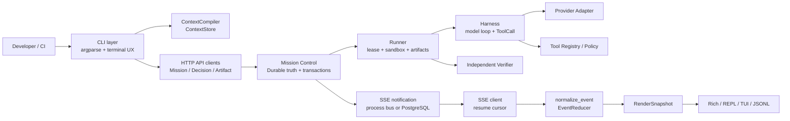

# AgentHub Production CLI Technical Specification

> Status: accepted (implementation SSOT)  
> Owner: AgentHub maintainers  
> Last reviewed: 2026-09-06  
> Scope: Python CLI, Mission Control HTTP/SSE integration, Harness/Runner
> execution, local state, release automation, and terminal UX.  
> Replaces: [north-star-developer-cli-experience.md](../roadmaps/north-star-developer-cli-experience.md), [cli-robustness-refactor.md](../development/cli-robustness-refactor.md)

This document is the implementation contract for making `agenthub` a
production-grade developer CLI. It is normative for new code and for
migration work. Executable contracts and tests take precedence when this
document and implementation disagree; this document must then be updated in
the same change.

## 1. Product Definition

### 1.1 Problem and outcome

AgentHub is a Python developer CLI that turns a natural-language development
objective into an auditable Mission. It must read a real repository, plan and
execute bounded WorkUnits, stream model/tool progress, ask before side
effects, verify results independently, and leave a reviewable patch that can
be restored without overwriting concurrent user changes.

The north-star command is:

```text
agenthub "修复登录失败并运行相关测试"
```

The expected outcome is a durable, resumable loop:

```text
objective -> Mission/Contract -> WorkUnit -> Harness/Runner
          -> model/tool events over SSE -> Decision (if needed)
          -> Artifact/Evidence -> independent verification -> Outcome
```

### 1.2 Functional scope

1. Interactive `chat`, one-shot `run`, and machine-readable `exec --json`.
2. Model text streaming and structured function/tool calls.
3. Read-only repository inspection and controlled code changes.
4. Human-in-the-loop decisions for shell, file, Git, network, and package
   side effects.
5. Attempt-level snapshots, conflict-safe restore, Git diff, and audit data.
6. Mission resume, context compilation, compact summaries, and local history.
7. Provider health, retries, degraded status, diagnostics, and release checks.

### 1.3 Non-functional requirements

| Area | Requirement | Measurement |
|---|---|---|
| Startup | `agenthub --help` completes in <100 ms when dependencies are present | p95 on supported CI runners |
| Streaming | First SSE/text event is visible without waiting for Mission completion | benchmark `firstEventSeconds`, `firstTokenSeconds` |
| Reliability | No duplicate side effect after reconnect or duplicate event | reducer/integration tests |
| Safety | Unknown permission or conflicting file hash fails closed | negative tests and audit record |
| Resource use | Every network/child-process operation has timeout and bounded output | contract tests, process inspection |
| Shutdown | SIGINT/Ctrl-C cancels owned work and closes clients without traceback | TTY and headless tests |
| Automation | `--json`/`--jsonl` stdout is parseable and contains no human UI text | JSON schema tests |
| Observability | Every operation has request/mission/attempt identifiers and classified errors | structured logs and receipts |

`production-verified` is never inferred from a fixture. It requires evidence
from a real provider, physical TTY, released registry artifact, or deployed
multi-process service as defined in `docs/development/documentation-status.md`.

## 2. Architecture

### 2.1 Ownership boundaries



| Boundary | Owns | Must not own |
|---|---|---|
| CLI | argument routing, session commands, event consumption, rendering | Mission truth, model loop, direct provider parsing |
| ContextStore/Compiler | ordered context records and bounded model input | Mission status transitions |
| Mission Control | Mission, Contract, WorkUnit, Decision, Artifact, Evidence, Outcome and event ledger | model prompts or local UI state |
| Runner | lease, attempt isolation, process limits, Artifact collection | verification verdict or hidden commits |
| Harness | bounded model/tool loop, budgets, structured calls, checkpoints | durable Mission state |
| Verifier | independent checks and Evidence | executor's success claim |
| Adapter | provider request/response normalization | provider-specific logic in CLI |
| Renderer | pure projection of `RenderSnapshot` | raw event parsing or state inference |

Legacy Task/DAG/AgentNet/MCP/A2A types may remain adapters, but cannot become
additional sources of business truth.

### 2.2 Repository module layout

The current repository is Python-first. New code follows these ownership
paths; a migration may keep compatibility shims, but new callers use the
canonical path.

```text
app/cli/
  main.py                 # argparse and command exit codes
  chat.py                 # REPL orchestration, no business state
  transport.py            # HTTP connection/auth/retry boundary
  sse.py                  # standards-compliant frame parser
  sse_client.py           # stream lifecycle and reconnect signal
  events.py               # event normalization and cursor
  reducer.py              # sole UI state reducer
  ui.py, tui.py           # RenderSnapshot projections only
  errors.py               # ErrorEnvelope projection and exit mapping
app/services/
  mission/                # Mission Control use cases
  harness_service.py      # model/tool loop
  model_port.py           # canonical model DTOs/port
  adapter_manager.py      # provider adapters
  context_store.py        # durable context index
  context_compiler.py     # bounded ContextManifest compiler
  desktop_runner_tools.py # explicit desktop tool registry
  tools/                  # handlers and schemas
  mission_event_bus.py    # in-process fallback + PostgreSQL notifier
app/domain/               # immutable domain models and transitions
tests/cli, tests/api, tests/services/
```

## 3. Canonical Contracts

### 3.1 Model and tool protocol

All new model calls use structured DTOs. `PromptAdapterPort`, `ModelPort` and
the legacy string parser are compatibility boundaries only and must converge
on this interface.

```python
from dataclasses import dataclass
from typing import AsyncIterator, Mapping, Protocol

@dataclass(frozen=True)
class Message:
    role: str                 # system | user | assistant | tool
    content: str
    source_id: str = ""

@dataclass(frozen=True)
class ToolCall:
    call_id: str
    name: str
    arguments: Mapping[str, object]
    arguments_complete: bool = True

@dataclass(frozen=True)
class ModelRequest:
    messages: tuple[Message, ...]
    tools: tuple[Mapping[str, object], ...] = ()
    stream: bool = True
    tool_choice: str = "auto"
    timeout_seconds: float = 60.0

@dataclass(frozen=True)
class ModelStreamEvent:
    kind: str                 # text_delta | tool_call_delta | completed | error
    text: str = ""
    tool_call: ToolCall | None = None
    usage: Mapping[str, int] = ()
    error: "ErrorEnvelope | None" = None

@dataclass(frozen=True)
class ModelResponse:
    text: str
    tool_calls: tuple[ToolCall, ...] = ()
    usage: Mapping[str, int] = ()

class ModelPort(Protocol):
    async def stream(self, request: ModelRequest) -> AsyncIterator[ModelStreamEvent]: ...
    async def complete(self, request: ModelRequest) -> ModelResponse: ...
```

Rules:

- `call_id` is mandatory for new tool events; missing IDs are diagnostics and
  must never merge same-named concurrent calls.
- Invalid JSON or arguments are structured provider/tool errors, never a
  best-effort execution.
- `stream=True` and tool availability are independent settings.
- The adapter owns provider-specific fields, thinking markers, and tool-call
  chunk assembly; Harness sees only the canonical DTOs.

### 3.2 Versioned SSE envelope

```json
{
  "schemaVersion": 1,
  "eventId": "evt-123",
  "missionId": "mis-123",
  "aggregate": {"type": "mission", "id": "mis-123", "sequence": 12},
  "type": "assistant.delta",
  "payload": {"text": "正在检查登录逻辑..."}
}
```

Canonical event names include `mission.created`, `work_unit.claimed`,
`work_unit.running`, `assistant.delta`, `tool.started`, `tool.output`,
`checkpoint.created`, `decision.pending`, `artifact.registered`,
`verification.started`, `verification.completed`, and `mission.completed`.

Compatibility aliases (`eventType`, `event_type`, snake/camel IDs) are accepted
only in `normalize_event`; all internal state uses canonical fields. Recovery
accepts `Last-Event-ID`, `afterEventId`, and `afterSequence`, with this order:

```text
Last-Event-ID/afterEventId -> resolve durable event sequence -> catch up ledger
```

The CLI deduplicates by `eventId` and advances the Mission aggregate cursor
only for Mission events. WorkUnit/Decision sequences are independent.

### 3.3 Error envelope

Every provider, tool, HTTP, SSE, CLI, and JSONL error projects this shape:

```json
{
  "errorType": "permission_denied",
  "category": "permission",
  "retryable": false,
  "message": "工具访问被策略拒绝",
  "details": {"tool": "file_write", "path": "src/app.py"},
  "requestId": "req-123"
}
```

Canonical categories are `config`, `auth`, `transport`, `timeout`, `protocol`,
`provider`, `permission`, `validation`, `conflict`, `execution`, and
`internal`. A single mapper converts exceptions to this envelope. Human UI,
JSONL, and CI only project it; they do not infer categories independently.

Exit codes are stable: `0` success, `1` mission/provider failure, `2` usage or
validation error, `3` permission/decision denial, `4` timeout/cancelled, and
`70` infrastructure failure.

### 3.4 Context contract

`ContextStore` is the only business read/write entry point for session context.
Each record contains `source`, `source_id`, `mission_id`, `event_id`, role,
content, and creation time. `ContextCompiler` produces the only model input.

```python
@dataclass(frozen=True)
class ContextSource:
    kind: str                 # message | mission | compact | project | memory
    source_id: str
    priority: int

@dataclass(frozen=True)
class ContextBudget:
    max_tokens: int
    reserved_output_tokens: int

@dataclass(frozen=True)
class ContextManifest:
    messages: tuple[Message, ...]
    sources: tuple[ContextSource, ...]
    covered_missions: tuple[str, ...]
    token_estimate: int
    omitted: tuple[str, ...] = ()

class ContextCompiler(Protocol):
    def compile(self, *, session_id: str, budget: ContextBudget) -> ContextManifest: ...
```

Priority is fixed: current session messages, Mission chain, structured compact
summary, project instructions/facts, long-term memory. Compression must retain
covered message/Mission ranges, decisions, file changes, Artifacts, unresolved
issues, failures/limits, and original event IDs.

## 4. Mission Execution and Data Flow

1. `main.py` parses arguments and resolves configuration without starting the
   model or runner prematurely.
2. CLI loads `ContextStore`, project instructions, permission policy, and
   model settings. Secrets come only from environment/secret managers.
3. For a Mission request, CLI calls `POST /api/v1/missions` and `/start`, then
   obtains the stream URL and opens `GET /events/stream`.
4. `SseClient` parses frames. On disconnect it emits `sse.reconnecting`, keeps
   the last durable cursor, and reconnects. A bounded ledger poll is fallback
   only; it must not execute a side effect.
5. Every event is normalized, deduplicated, reduced, and rendered. `decision.pending`
   is resolved immediately through the Decision API with `expectedVersion`.
6. Harness receives a compiled context and canonical `ModelRequest`, emits
   text/tool/checkpoint events, and executes only the resolved ToolSet.
7. Runner enforces workspace isolation, attempt snapshot, lease, process
   limits, and Artifact collection. It never silently commits.
8. Verifier independently checks Artifact/Evidence and Mission Control performs
   the terminal transition transactionally.
9. CLI persists the user turn, assistant deltas/result, Mission ID, and event
   references in `ContextStore`; `/resume` changes only the chain pointer.
10. Terminal UI shows a result panel with status, duration, token usage,
    Artifact count, verification verdict, and restore instructions.

### 4.1 Side-effect policy

`ToolExecutionPolicy` is the single configuration object shared by CLI,
Runner, and tests:

```python
@dataclass(frozen=True)
class ToolExecutionPolicy:
    mode: str                 # suggest | edit | auto
    allow_code_execute: bool
    allow_shell: bool
    workspace_root: Path
```

Effective permission order is:

```text
server deny > Contract capability > server path policy > local deny
             > local allow > interactive confirmation
```

Unknown, ambiguous, or unavailable capability is denied. `suggest` permits
read-only tools only; `edit` permits workspace edits after Decision;
`auto` is reserved for explicitly trusted automation and remains bounded by
server policy and Contract capability.

## 5. Reliability and Security Standards

### 5.1 Network and concurrency

- Every HTTP/SSE/provider request has connect, read, write, and total timeout.
- Shared `HttpTransport` owns connection pooling, auth headers, request IDs,
  retry classification, and exponential backoff with jitter.
- Retry only idempotent requests and retryable `transport`, `timeout`, 429, and
  selected 5xx failures. Never retry a Decision resolution or side effect
  without an idempotency key.
- Use semaphores for provider calls, event subscribers, child processes, and
  tool calls. Limits are configurable but bounded by safe defaults.
- Cancellation propagates from CLI signal to Mission cancel, Runner process,
  and HTTP stream; cleanup is idempotent.

### 5.2 File and Git safety

All writes require `expected_sha256`; a new file uses `""`. External changes
are a hard conflict, not a warning. Multi-file changes use transactional
`apply_change_set`; `git apply --check` or strict unified-diff validation is
mandatory. A successful change runs, as applicable:

```text
hash precondition -> write -> diff check -> formatter -> type checker
-> affected tests -> audit report -> explicit human commit
```

Attempt snapshots include tracked/untracked files, binary bytes, symlink and
permission metadata, Git index state, and file provenance. `/undo` previews all
conflicts and restores atomically; it never deletes a newly external file or
silently runs `git restore` across unrelated changes.

### 5.3 Logging and privacy

Use structured logs with `request_id`, `mission_id`, `work_unit_id`, `attempt`,
`event_id`, provider/model, duration, and classified error. Never log API keys,
full authorization headers, raw prompts, tool secrets, or unrestricted file
contents. Redaction is applied before CI artifacts are written.

## 6. Terminal and Machine UX

### 6.1 Render pipeline

```text
raw SSE/adapter event
  -> normalize_event
  -> EventReducer
  -> RenderSnapshot
  -> Rich / REPL / TUI / JSONL projection
```

Renderers cannot consume raw events or implement independent thinking/error/tool
status logic. Thinking is collapsed by default and can be expanded with
`/thinking`; streamed assistant text remains visible and ordered.

Rich/TUI requirements:

- Header: workspace, Git branch, provider/model, degraded indicator.
- Live status: spinner, current phase, elapsed time, connection state.
- Tool panel: call ID, tool name, started/output/completed/failed state.
- Decision panel: requested capability, path, full裁决链, and Yes/No/Always.
- Result panel: terminal status, verifier, token/cost, Artifacts, restore hint.
- Widths 40/80/120 and non-TTY output must remain coherent and non-blocking.

Machine output requirements:

- `--json` emits one stable object; `--jsonl` emits one versioned event per
  line on stdout and sends diagnostics to stderr.
- `--quiet` suppresses human progress but never suppresses errors or final
  status. `--verbose` enables structured diagnostics, never secrets.

## 7. Test and Evidence Matrix

Every capability has an evidence level: `unit`, `contract`, `integration`,
`real-provider`, `real-tty`, `cross-platform`, or `production`.

| Suite | Required cases | Evidence target |
|---|---|---|
| Model contract | text deltas, split tool args, empty chunks, invalid JSON, 401/429/5xx/timeout | unit/contract |
| SSE | empty frame, multiline data, heartbeat, duplicate/late/out-of-order events, Last-Event-ID | contract/integration |
| Recovery | disconnect before/after Decision, reconnect cursor, no duplicate side effect | integration |
| Reducer/renderers | Rich/REPL/TUI/JSONL snapshots from identical fixtures; widths 40/80/120 | contract/real-tty |
| Context | priority, token budget, compression manifest, `/resume`, `/context` | unit/integration |
| File safety | hash conflict, binary/symlink/mode, same file in multiple WorkUnits, atomic rollback | integration |
| Permission | server deny, local allow, Contract deny, import conflict, audit replay | contract/integration |
| Provider | DeepSeek v4-flash/v4-pro text and tool loop, degraded state | real-provider nightly |
| Release | frozen install, npm registry install/upgrade/rollback on supported OSes | cross-platform |
| Benchmark | first event/token/tool feedback, recovery success, false-operation rate | production trend |

Tests must use explicit names for their evidence level. A fixture or mock can
never mark a capability `production-verified`.

## 8. Implementation Roadmap

### Milestone 1: Infrastructure and skeleton

- Keep one configuration resolver with environment override and safe defaults.
- Stabilize `HttpTransport`, `ErrorEnvelope`, exit codes, request IDs, and
  signal handling.
- Make `ContextStore` and `ToolExecutionPolicy` the only shared configuration
  sources.
- Add contract tests before migrating callers.

**Exit gate:** `--help`, `doctor`, JSON output, startup/shutdown and transport
tests pass on a clean Python environment.

### Milestone 2: Core Mission and API closure

- Migrate model calls to `ModelRequest`/`ModelStreamEvent`/`ToolCall`.
- Complete Mission, Decision, Artifact API facades and ErrorEnvelope mapping.
- Make ContextCompiler the only model context entry point.
- Enforce hash-checked transactional file changes and independent verification.

**Exit gate:** a mock repository task creates a Mission, performs a permitted
change, streams events, verifies an Artifact, and restores safely on conflict.

### Milestone 3: Streaming and terminal UX

- Use SSE as the primary Mission interaction path with durable cursor recovery.
- Finish reducer-only Rich/REPL/TUI/JSONL projections and collapsed thinking.
- Add immediate Decision handling, provider degraded display, and benchmark
  telemetry.

**Exit gate:** all renderers produce the same snapshot; disconnect/reconnect,
Decision race, and narrow-width tests pass.

### Milestone 4: Provider and reliability hardening

- Run opt-in nightly DeepSeek v4-flash and v4-pro text/tool loops.
- Add complete provider error fixtures and continuous-failure alerts.
- Connect PostgreSQL LISTEN/NOTIFY in application lifespan with explicit
  SQLite/in-process fallback behavior and multi-process tests.

**Exit gate:** real-provider artifacts are redacted, failures are classified,
and no provider is called production-ready without recent evidence.

### Milestone 5: Packaging and release

- Publish frozen binaries and npm wrapper from one version source.
- Run post-publish clean-machine install/upgrade/rollback jobs on each
  supported OS; unsupported platforms must report a stable diagnostic.
- Gate release promotion on tests, provider evidence, TTY evidence, and
  registry evidence.

**Exit gate:** a release manifest links all evidence and rollback instructions.

### Milestone 6: Continuous benchmark

- Maintain anonymized real-world task fixtures and versioned thresholds.
- Track first token, tool feedback, total latency, token cost, recovery rate,
  verification visibility, and unintended-operation rate.
- Convert every material failure into a regression test or an explicit issue
  in `docs/development/ai-problem-solving-log.md`.

## 9. Definition of Done and Operating Rules

A feature is `implemented` only when code and automated tests pass. It is
`production-verified` only when the applicable real evidence is attached.
Every change must:

1. Read this document and the nearest module README before editing.
2. Add or update a contract test before changing a boundary.
3. Preserve user files and unrelated dirty-worktree changes.
4. Avoid synthetic success, hidden commits, silent fallback, or secret output.
5. Keep one small vertical commit per subtask; do not push from automation.
6. Update this SSOT and the evidence log when behavior or status changes.

The following are explicit non-goals for a production claim until evidence
exists: real multi-process PostgreSQL notification, arbitrary provider tool
reliability, physical TTY behavior, and cross-platform npm registry behavior.
