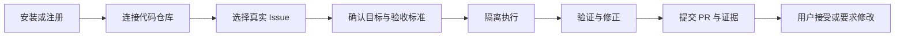
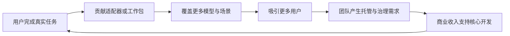

# AgentHub 产品方案 v1.0

> 文档状态：后续产品迭代基线  
> 更新时间：2026-08-01  
> 适用范围：开源社区版、托管云版、企业版  
> 核心决策：先解决软件团队的可验证工作交付，再扩展为通用工作委托与结果保障系统

## 1. 执行摘要

AgentHub 不再以“创建和管理 Agent”为核心产品目标。Agent、模型、Prompt 和工作流都将逐渐成为低成本、可替换的执行资源。产品真正需要长期持有的是工作目标、权限边界、执行状态、产物证据、人工决策和最终结果。

首个产品定位：

> AgentHub 是一个开源、自托管、模型中立的 AI 软件任务执行系统。它把 Issue 转化为隔离执行、通过验证、附带证据且可供人工审查的 Pull Request。

长期产品定位：

> AgentHub 是工作委托与结果保障层。用户定义目标、约束和验收条件，系统组织可替换的 AI 执行者完成工作，并对权限、证据、异常和结果负责。

产品采用开放核心模式：

- Community：个人与小团队可永久免费完成真实任务。
- Cloud：为不希望维护 Runner、队列、存储和升级的团队提供托管服务。
- Enterprise：为组织提供身份、策略、审计、规模、数据驻留和服务保障。

## 2. 从根本问题出发

### 2.1 用户购买的不是 Agent

用户不会因为系统拥有更多角色、更多节点或更复杂的架构而持续使用。用户购买的是更快、更可靠、更低成本的工作结果。

软件团队的典型结果包括：

- 一个缺陷被修复并通过回归测试。
- 一个依赖漏洞被升级且没有破坏兼容性。
- 一个 Issue 被转化为可审查的 PR。
- 一次 API 迁移完成并附带变更说明。
- 一批重复性维护任务被安全处理。

因此，产品的一级对象必须从 Agent 改为 Mission 和 Outcome。

### 2.2 模型能力增强不会消除的需求

即使未来模型拥有近乎完美的推理、无限上下文、原生工具调用和极低成本，以下问题仍然存在：

- 谁授权模型读取、修改或发布什么内容。
- 哪些操作可以自动完成，哪些必须由人确认。
- 系统如何证明工作真的完成，而不是仅声称完成。
- 外部服务失败、需求冲突和权限不足时如何恢复。
- 一个结果被接受、拒绝或回滚后，组织如何学习。
- 多个模型或 Agent 参与后，责任和成本如何归属。

AgentHub 的长期价值不是比模型更聪明，而是让更强的模型能够获得有限权力、完成真实工作并提交可信结果。

## 3. 市场选择

### 3.1 初始目标市场

优先服务以下客户：

- 20 至 200 人的软件公司、研发团队和交付团队。
- 已使用 Codex、Claude Code、Cursor、Copilot 或本地模型。
- 存在大量缺陷修复、依赖升级、测试补齐、迁移和安全整改任务。
- 使用 GitHub、GitLab 或 Gitee 管理研发工作。
- 对源码隐私、模型中立或私有部署有明确要求。
- 有能力评估 PR、测试和构建结果。

其中，软件外包、交付型团队和企业内部研发平台团队是优先设计合作对象。这些客户任务密度高、成本清晰、验收明确，更容易验证产品价值。

### 3.2 暂不优先的市场

- 普通消费者通用助理。
- 通用客服聊天机器人。
- 只需要简单知识问答的客户。
- 完全没有技术能力且需要大量定制的组织。
- 以节点数量、模板数量或连接器数量为主要购买依据的用户。

这些市场要么被大型入口平台控制，要么需要与成熟低代码产品进行高成本正面竞争。

### 3.3 购买与使用角色

| 角色 | 核心任务 | 产品价值 | 主要阻力 |
|---|---|---|---|
| 研发负责人 | 提升交付吞吐和可预测性 | 周期、成本、质量和风险可量化 | 担心无法证明 ROI |
| 技术负责人 | 拆解任务、分配工作、审查结果 | 减少跟进和重复审查 | 担心产生更多低质量 PR |
| 开发者 | 完成开发和维护任务 | 减少重复劳动，保留最终控制 | 担心被替代或上下文切换增加 |
| 安全与运维 | 控制源码、密钥和生产权限 | 自托管、审批、审计和恢复 | 担心 Agent 获得过大权限 |
| 开源贡献者 | 扩展模型、工具和验证能力 | 稳定接口、良好文档和声誉 | 担心商业版侵蚀社区权益 |

## 4. 核心用户任务

### 4.1 Jobs To Be Done

当团队存在一个边界清晰、结果可验证的软件任务时，用户希望把重复分析、实现、测试和修正过程交给 AI，同时保留关键决策权，以便更快获得可以接受的结果，而不增加安全和审查负担。

### 4.2 初始任务排序

| 优先级 | 场景 | 原因 | 验收信号 |
|---|---|---|---|
| P0 | Issue 到 PR | 高频、链路完整、结果清晰 | PR 可审查、测试通过 |
| P0 | 测试失败自动修复 | 输入明确、反馈确定 | CI 恢复通过 |
| P0 | 依赖与 CVE 修复 | 价值高、流程重复 | 漏洞消除、兼容测试通过 |
| P1 | 测试覆盖提升 | 适合异步执行 | 覆盖率提升且行为不变 |
| P1 | API/SDK 迁移 | 适合任务拆解 | 编译与契约测试通过 |
| P1 | 文档与代码同步 | 风险较低 | 文档检查通过 |
| P2 | 跨仓库项目交付 | 价值高但复杂 | 多仓库验收条件满足 |

## 5. 产品核心模型

### 5.1 Mission

用户委托给系统的一项完整工作，包含目标、边界、预算、截止时间和验收条件。

### 5.2 Contract

系统与用户之间的委托契约，明确：

- 允许访问的仓库、目录、分支和外部系统。
- 时间、模型调用和计算预算。
- 可以自动执行的操作。
- 必须由人确认的决策门。
- 完成和失败的判定标准。

### 5.3 WorkUnit

Mission 被拆解后的最小可调度工作单元。WorkUnit 具有明确输入、输出、依赖、执行者、重试策略和验证器。

### 5.4 Artifact

执行过程中产生的代码、Diff、Commit、日志、报告、测试结果、构建产物或 PR。

### 5.5 Evidence

证明 Artifact 和 Mission 满足契约的外部证据。证据必须包含来源、生成者、时间、完整性摘要和验证状态。

### 5.6 Decision

需要人工接受、拒绝、修改权限、补充信息、重新规划或终止的决策节点。

### 5.7 Outcome

Mission 的真实业务结果，包括是否被接受、是否合并、是否回滚、耗时、成本和人工介入次数。

### 5.8 Feedback

用户对结果的接受、修改、拒绝和回滚行为。Feedback 用于改进任务路由、工作包和验证策略，不用于未经授权训练外部模型。

## 6. 核心体验

### 6.1 首次价值路径

产品目标是让陌生用户在五分钟内启动，在三十分钟内看到第一个简单任务的可审查结果。

### 6.2 信息架构

第一阶段只保留五个主要入口：

1. Missions：任务收件箱、状态、预算和负责人。
2. Work Graph：任务依赖、当前执行、等待和失败位置。
3. Evidence：Diff、测试、构建、安全检查和风险说明。
4. Decisions：等待用户处理的审批、冲突和异常。
5. Settings：仓库、Runner、模型、凭据和策略。

Agent 列表、工作流画布和模型面板作为高级配置存在，不再占据首页和主导航中心。

### 6.3 产品原则

- 结果优先：界面首先展示产物和证据，而非思考文本。
- 渐进自主：从建议、草稿、执行到发布逐级授予权限。
- 失败可见：不得把后端失败伪装为 Demo 成功。
- 默认可恢复：任何长任务都能暂停、恢复、取消和回放。
- 模型中立：模型和 Agent 可以替换，Mission 数据不能被供应商锁定。
- 人掌握最终决定：高风险和不可逆操作必须进入决策门。
- 本地优先：Community 默认不需要把源码、Prompt 或轨迹上传到外部服务。

## 7. 版本与商业模式

### 7.1 Community Edition

Community 必须完整解决个人和小团队的真实任务：

- 本地或自托管运行。
- 单仓库与基础多仓库 Mission。
- 主流编码 Agent 和模型适配。
- GitHub、GitLab、Gitee 集成。
- worktree、沙箱、测试、Diff、Commit 和 PR。
- 基础权限策略、审批和审计导出。
- 本地任务历史、证据和回放。
- 插件 SDK、公共 API 和 Work Pack。

Community 不是试用版，不设置执行次数或时间限制。许可证优先使用 Apache 2.0，企业模块放入独立商业许可目录。遥测默认关闭。

### 7.2 AgentHub Cloud

Cloud 销售的是托管便利和弹性：

- 托管 Runner 和隔离环境。
- 无需维护数据库、队列、升级和备份。
- 远程异步任务与并行执行。
- 共享工作空间、凭据和通知。
- 使用量、成本和预算控制。
- 可选 BYOK，模型成本透明。

建议采用免费额度加用量计费，允许用户设置硬预算，避免不可预测账单。

### 7.3 Enterprise Edition

Enterprise 销售的是组织复杂度和责任保障：

- SSO、SAML/OIDC、SCIM、LDAP。
- 组织、团队、项目和环境级权限。
- 高级 ABAC、策略即代码和审批链。
- 密钥托管、短期凭据和企业 KMS。
- 不可篡改审计、留存和数据驻留。
- 私有 Runner 池、HA、灾备和跨区域部署。
- 空气隔离、离线模型和升级通道。
- SLA、迁移支持、安全响应和专业服务。

### 7.4 定价假设

价格在用户验证前不固定，只验证以下结构：

- Community：永久免费。
- Cloud Free：单用户、低并发和有限托管计算额度。
- Cloud Team：工作空间订阅加实际 Runner 使用量。
- Enterprise：按组织规模、Runner 节点、治理能力和支持等级签约。
- Work Pack：后期可采用一次性购买、订阅或收入分成。

不按 Agent 数量收费。Agent 数量不能代表用户价值。对外重点展示每个成功 Mission 的成本。

## 8. 开源增长与社区

### 8.1 GitHub 仓库即产品首页

公开发布前必须具备：

- 一句话价值主张和三十秒真实演示。
- 三条命令以内的 Quick Start。
- 可直接运行的示例仓库和五个示例任务。
- 清晰的成熟度、已知限制和安全边界。
- LICENSE、CONTRIBUTING、SECURITY、CODE_OF_CONDUCT。
- 自动化测试、发布产物和版本升级说明。
- 公共路线图、Discussion 和问题模板。

README 先展示任务结果，再介绍架构。禁止以容器数量、服务数量和未经验证的性能声明作为卖点。

### 8.2 社区贡献面

优先开放以下扩展点：

- Agent Harness Adapter。
- 模型 Provider Adapter。
- SCM 和通知连接器。
- Verifier 和安全策略。
- Work Pack 和评估数据集。
- 示例项目与公开基准。

核心调度协议保持稳定和严格，降低社区插件被内部重构破坏的概率。

### 8.3 增长飞轮

## 9. 获客、激活、留存和收入

| 阶段 | 用户行为 | 关键指标 |
|---|---|---|
| 发现 | 访问 GitHub 或安装插件 | README 到安装转化率 |
| 激活 | 完成第一个真实 Mission | 首次成功时间、首次成功率 |
| 价值 | 获得被接受的 PR | 结果接受率、审查修改量 |
| 留存 | 每周持续提交任务 | 4 周留存、周成功 Mission |
| 扩展 | 邀请成员、增加仓库 | 活跃团队、活跃仓库 |
| 付费 | 使用 Cloud 或企业治理 | 社区到云转化、续费率 |
| 推荐 | 分享工作包或公开基准 | 外部贡献、自然安装来源 |

北极星指标：每周被用户接受的 Mission 数量。

质量护栏：

- 合并后回滚率。
- 严重安全事件数。
- 单个成功 Mission 成本。
- 每个 Mission 人工介入次数。
- 用户主动提高自主权限的比例。

GitHub Star、Token 数量和创建 Agent 数量只作为辅助指标。

## 10. 用户验证计划

### 10.1 0 至 30 天

- 访谈 20 个目标团队，使用过去事实而不是意向问题。
- 收集 5 个真实仓库和至少 50 个历史任务。
- 找到 3 至 5 个设计合作团队。
- 通过人工辅助方式完成任务，记录失败和干预原因。
- 确定三个最高频、最容易验收的工作包。

### 10.2 31 至 60 天

- 交付 Community Alpha。
- 让 20 个真实用户完成 100 个 Mission。
- 只产品化重复出现的流程。
- 至少让一个设计合作客户付费。
- 建立首次成功、接受率、人工介入和任务成本指标。

### 10.3 61 至 90 天

- 公开发布 Community Beta。
- 启动 Cloud 等候名单和小范围托管 Runner。
- 发布第一个公开任务基准。
- 验证团队是否愿意邀请成员和增加仓库。
- 根据留存而不是功能请求决定下一阶段。

### 10.4 继续投入门槛

90 天后至少满足：

- 50% 以上任务能够形成可审查结果。
- 30% 以上结果无需重大重写即可接受。
- 目标任务周期相对人工流程缩短至少 30%。
- 至少 3 个团队连续 4 周使用。
- 至少 2 个团队愿意付费继续使用。
- 用户主动提交第二批任务，而非只完成演示任务。

若不满足，应调整用户或任务场景，不允许用增加基础设施和功能掩盖需求问题。

## 11. 产品路线图

### Phase 0：收缩与重构，0 至 6 周

- 建立 Mission、Contract、WorkUnit、Artifact、Evidence、Decision、Outcome 模型。
- 聚焦 Issue 到 PR 单一闭环。
- 将 Community 部署压缩到最小拓扑。
- 删除伪成功和默认 Demo 回退。
- 完成开源发布所需文档、安全和 CI 基线。

### Phase 1：Community Beta，6 至 12 周

- 支持 GitHub、GitLab、Gitee。
- 支持至少三种 Agent Harness。
- 完成隔离执行、验证、PR 和回放。
- 发布插件 SDK、三个 Work Pack 和公开基准。
- 建立真实产品指标。

### Phase 2：Cloud 与团队协作，3 至 6 个月

- 托管 Runner、远程任务和通知。
- 团队空间、共享配置和预算。
- 基础计费、免费额度和成本透明。
- 从社区用户中转化首批付费团队。

### Phase 3：Enterprise，6 至 12 个月

- 企业身份、策略、审计和私有 Runner 池。
- HA、备份、数据驻留和空气隔离。
- 企业采购、安全评估和支持体系。
- 形成可复制的研发交付解决方案。

### Phase 4：Outcome Platform，12 至 24 个月

- 跨仓库和跨系统 Mission。
- Verified Work Pack 市场。
- Agent 能力信誉和任务路由。
- 从软件研发扩展到规则清晰、结果可验证的专业工作。

## 12. 主要风险与停止线

| 风险 | 早期信号 | 应对方式 |
|---|---|---|
| 用户只看演示不交真实任务 | 无第二次使用 | 缩小场景并提高结果质量 |
| 审查成本高于人工完成 | PR 大量重写 | 加强契约、验证和任务边界 |
| 与单一编码 Agent 无差异 | 用户绕过 AgentHub | 强化证据、恢复、团队与模型中立 |
| 开源部署过重 | 安装后流失 | 单二进制或三容器上限 |
| 社区热度无法商业转化 | Star 高但无团队使用 | 以活跃 Mission 和团队扩展为准 |
| 免费版过弱 | 无真实采用 | 保证个人完整闭环永久免费 |
| 免费版覆盖全部企业价值 | 无升级理由 | 收费组织复杂度、托管和保障 |
| 每个客户都需要重度定制 | 服务成本失控 | 只产品化重复场景和扩展接口 |

停止线：完成 100 个真实任务后仍没有团队愿意持续使用或付费，应停止扩大平台范围，重新选择任务场景。

## 13. 最终产品判断

AgentHub 的成功不以 Agent 数量、微服务数量或模型能力衡量。成功的标志是用户形成稳定习惯：当一项真实软件工作出现时，用户首先把它作为 Mission 交给 AgentHub，并相信系统会在授权范围内执行、提交证据、暴露异常并把最终决定交还给人。

Community 负责让这种习惯以最低门槛发生；Cloud 负责让它持续运行；Enterprise 负责让组织敢于扩大授权。三者必须共享同一核心协议、数据模型和用户体验。
