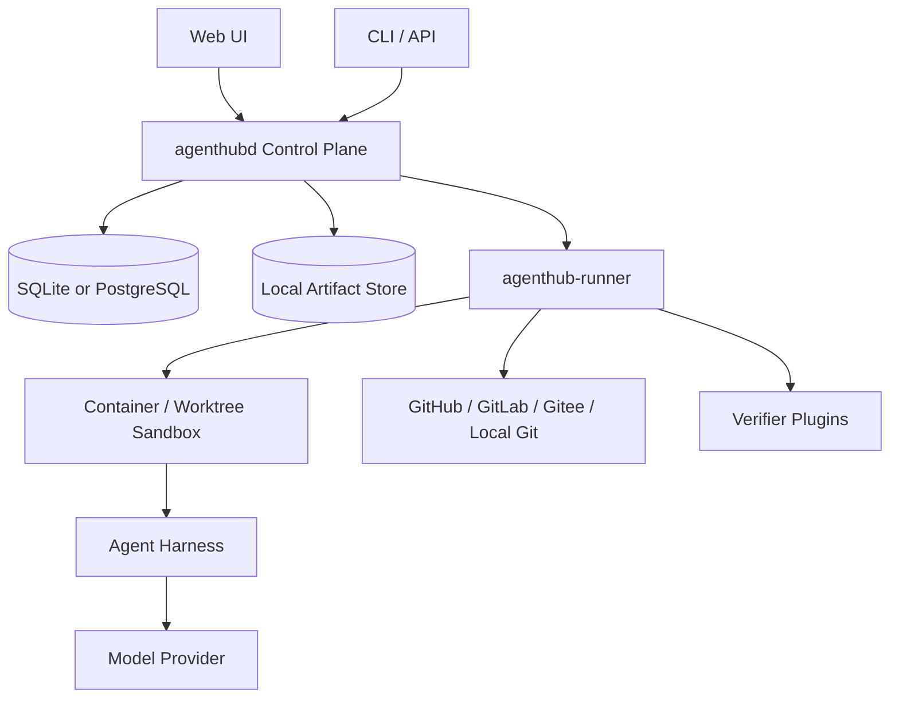
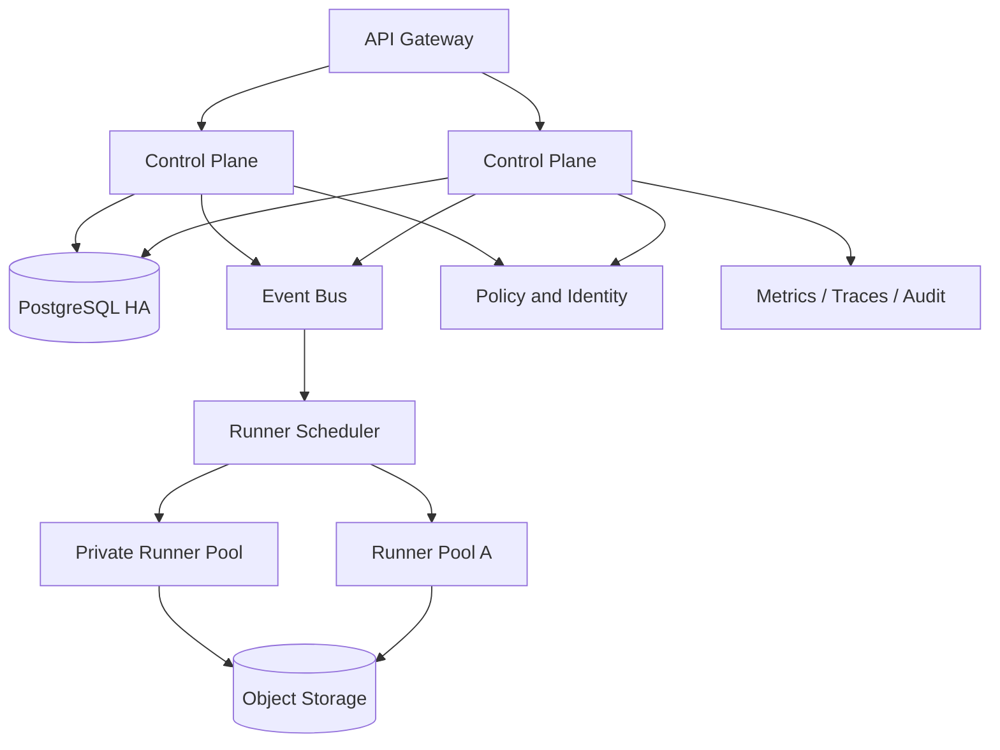

# AgentHub 技术方案 v1.0

> 文档状态：后续技术迭代基线  
> 更新时间：2026-08-01  
> 对应产品方案：`docs/strategy/product-plan-v1.md`  
> 核心目标：以最小可运行架构交付可验证 Mission，并为托管云和企业部署保留清晰扩展路径

## 1. 技术决策摘要

AgentHub 将从以 Agent、聊天会话和工作流配置为中心的多轨系统，重构为以 Mission、WorkUnit、Artifact、Evidence、Decision 和 Outcome 为中心的任务执行系统。

关键决策：

1. Community 采用模块化单体控制面加独立 Runner，不默认依赖 NATS、Redis、Qdrant、OpenSearch 或 Kubernetes。
2. 企业版与 Cloud 使用相同领域模型和协议，通过队列、对象存储、Runner 池和高可用数据库水平扩展。
3. Agent 和模型通过稳定 Adapter Protocol 接入，控制面不依赖任何具体 Agent 框架。
4. 执行与验证分离。执行者不能成为自身结果的唯一验证者。
5. 所有状态变化写入追加事件账本，支持恢复、回放、审计和指标计算。
6. Community 默认本地优先、遥测关闭、凭据不离开部署环境。
7. 现有服务按能力复用，不按现有服务边界整体迁移。没有用户负载证明的微服务不进入 Community 主链路。

## 2. 目标与非目标

### 2.1 目标

- 五分钟内启动 Community。
- 将一个仓库 Issue 转换成隔离、可恢复的任务执行。
- 生成 Diff、Commit、测试证据、风险说明和 PR。
- 支持人工审批、暂停、恢复、重试、取消和分叉重跑。
- 支持 Codex、Claude Code、OpenCode、本地模型等不同 Agent Harness。
- 支持 GitHub、GitLab、Gitee 和本地 Git。
- Community、Cloud、Enterprise 使用一致 API 和数据格式。
- 模型能力升级时只替换 Adapter，不重写任务、权限和验证层。

### 2.2 非目标

- 第一阶段不建设通用低代码工作流平台。
- 不以支持最多模型或最多节点为目标。
- 不默认运行 20 个以上服务。
- 不在 Community 默认启用向量数据库和复杂长期记忆。
- 不把模型思考文本作为可靠审计记录。
- 不允许执行失败时静默切换为伪成功结果。
- 不在验证用户需求前实现跨地域、万人并发和复杂多租户计费。

## 3. 架构原则

### 3.1 领域协议稳定，执行实现可替换

Mission、Contract、WorkUnit、Artifact、Evidence、Decision、Outcome 是稳定协议。模型、Agent Harness、队列、数据库和部署方式是可替换实现。

### 3.2 本地简单，远端可扩展

同一代码支持两种拓扑：

- Community：单节点控制面、SQLite 或 PostgreSQL、本地文件存储、本地 Runner。
- Cloud/Enterprise：多控制面实例、PostgreSQL、对象存储、消息系统和 Runner 池。

### 3.3 默认安全而非自动降级

安全组件不可用时任务必须停在明确状态。禁止从隔离容器自动降级为宿主机 subprocess。开发模式可显式选择非隔离执行，但必须有持续警告和审计标记。

### 3.4 证据优于叙述

测试退出码、Git Diff、构建摘要、扫描报告和 SCM 回执是证据。模型生成的“已完成”只能作为说明，不能改变 Mission 验收状态。

### 3.5 先模块化单体，后按负载拆分

只有满足以下条件之一才拆服务：

- 独立扩缩容需求明确。
- 安全隔离边界明确。
- 故障域需要独立。
- 使用不同运行环境且无法合理内嵌。
- 性能数据证明当前模块是瓶颈。

## 4. 总体架构

### 4.1 Community 拓扑



Community 发布物：

- `agenthubd`：API、调度、策略、事件账本、证据索引和嵌入式前端。
- `agenthub-runner`：仓库、沙箱、Agent Harness、验证器和产物上传。
- 可选 PostgreSQL。默认 SQLite 适合单用户和轻量团队。
- 本地 Artifact Store。可选 S3 兼容存储。

目标是一个二进制加一个 Runner，Docker Compose 不超过三个容器。

### 4.2 Cloud/Enterprise 拓扑



Cloud/Enterprise 可启用：

- PostgreSQL HA。
- NATS JetStream 或兼容消息系统。
- Redis 仅用于高频临时状态、租约和限流，不作为事实来源。
- S3/MinIO 存储产物和大证据。
- 多 Runner 池、区域和环境隔离。
- OIDC/SAML/SCIM、KMS 和不可篡改审计存储。

## 5. 领域模型

### 5.1 Mission

```typescript
interface Mission {
  id: string;
  workspaceId: string;
  title: string;
  objective: string;
  source: MissionSource;
  contractId: string;
  status: MissionStatus;
  planVersion: number;
  createdBy: ActorRef;
  createdAt: string;
  updatedAt: string;
}
```

Mission 状态：

```text
DRAFT -> READY -> RUNNING -> VERIFYING -> SUCCEEDED
                    |            |
                    v            v
             WAITING_DECISION  FAILED
                    |
                    v
             RUNNING / CANCELLED
```

状态只能由领域命令驱动，禁止任意数据库更新。

### 5.2 Contract

```typescript
interface MissionContract {
  id: string;
  repositoryScopes: RepositoryScope[];
  allowedCapabilities: CapabilityGrant[];
  budgets: { timeSeconds: number; modelCost: number; retries: number };
  acceptanceCriteria: AcceptanceCriterion[];
  decisionGates: DecisionGate[];
  forbiddenActions: string[];
  expiresAt?: string;
}
```

Contract 创建后不可原地修改。权限或验收条件变化生成新版本，并写入事件账本。

### 5.3 WorkUnit

```typescript
interface WorkUnit {
  id: string;
  missionId: string;
  kind: string;
  dependencies: string[];
  inputRefs: ArtifactRef[];
  expectedOutputs: OutputSpec[];
  requiredCapabilities: string[];
  assignedAdapter?: string;
  status: WorkUnitStatus;
  attempt: number;
  lease?: Lease;
}
```

WorkUnit 状态：

```text
PENDING -> LEASED -> RUNNING -> VERIFYING -> SUCCEEDED
                       |           |
                       v           v
                  WAITING       RETRYING
                       |           |
                       +-----> FAILED
```

每次尝试拥有独立 Attempt，保留输入、执行环境、Adapter 版本、成本和产物，禁止覆盖历史尝试。

### 5.4 Artifact

Artifact 只保存元数据和内容地址：

- 类型：diff、commit、file、log、report、test-result、build、pull-request。
- SHA-256 完整性摘要。
- 生产者 Actor、WorkUnit 和 Attempt。
- 来源仓库和基准 Commit。
- 内容大小、MIME、保留策略和敏感级别。

### 5.5 Evidence

```typescript
interface Evidence {
  id: string;
  missionId: string;
  workUnitId?: string;
  criterionId: string;
  verifier: VerifierRef;
  verdict: "PASS" | "FAIL" | "INCONCLUSIVE";
  artifactRefs: ArtifactRef[];
  summary: string;
  generatedAt: string;
  integrityHash: string;
}
```

Mission 只有在所有必需 Criterion 获得有效 PASS，且没有未解决阻断 Decision 时才能进入 SUCCEEDED。

### 5.6 Decision

Decision 包含请求原因、选项、推荐项、风险、上下文快照、过期时间和决定者。Decision 必须幂等，过期后不得自动执行原操作。

### 5.7 Outcome 与 Feedback

Outcome 记录接受、合并、部署、回滚和业务指标。Feedback 记录用户对 Artifact 的修改和拒绝原因。两者与原始执行事件分离，支持后续评估和路由优化。

## 6. 事件账本与恢复

### 6.1 事件格式

```json
{
  "event_id": "evt_...",
  "aggregate_type": "mission",
  "aggregate_id": "mis_...",
  "sequence": 42,
  "event_type": "work_unit.verification.completed",
  "actor": { "type": "verifier", "id": "pytest-v1" },
  "occurred_at": "2026-08-01T00:00:00Z",
  "correlation_id": "...",
  "causation_id": "...",
  "payload": {},
  "schema_version": 1
}
```

约束：

- 同一 Aggregate 的 sequence 单调递增并具有唯一约束。
- 命令处理和事件追加在同一数据库事务中完成。
- 外部消息通过 Outbox 发布，消费者以 event_id 幂等。
- 状态表是事件投影，用于查询，不是唯一事实来源。
- 大日志和产物不进入事件 Payload，只保存 ArtifactRef。

### 6.2 恢复策略

- 控制面重启：从数据库投影继续，必要时按事件重建。
- Runner 失联：租约到期后 WorkUnit 转为 RETRYING。
- Agent 超时：保存当前 Artifact 和日志，按策略重试或请求 Decision。
- 验证失败：允许创建修正 WorkUnit，不覆盖失败证据。
- 用户修改契约：创建新 Contract 版本，从指定 Checkpoint 分叉运行。

## 7. 调度与执行

### 7.1 Planner

Planner 将 Mission 转换成 Work Graph，但计划必须通过确定性校验：

- 节点 ID 和依赖合法。
- 无循环依赖。
- 所需 Capability 在 Contract 范围内。
- 每个输出至少映射一个验收条件或后续输入。
- 风险操作前存在 Decision Gate。
- 总预算不超过 Contract。

Planner 可以由模型实现，但校验器必须是确定性代码。

### 7.2 Scheduler

- 找到依赖已满足的 PENDING WorkUnit。
- 依据 Capability、仓库位置、数据驻留和并发预算选择 Runner。
- 使用带过期时间的 Lease 防止重复执行。
- 单个 WorkUnit 至少一次投递，执行端通过 attempt_id 幂等。
- 取消 Mission 时撤销未开始 Lease，并向运行中任务发送取消信号。

### 7.3 Runner

Runner 生命周期：

1. 领取带签名的 WorkUnit Lease。
2. 获取短期 Capability Token。
3. 创建仓库镜像或 worktree。
4. 启动隔离环境。
5. 调用 Agent Harness Adapter。
6. 收集文件变更、日志和成本。
7. 执行 Verifier。
8. 上传 Artifact 和 Evidence。
9. 清理工作区并归还 Lease。

Runner 不能直接改变 Mission 最终状态，只能提交事件和证据。

## 8. Adapter Protocol

### 8.1 Adapter 类型

- Agent Harness Adapter：Codex、Claude Code、OpenCode、自研 Agent。
- Model Provider Adapter：OpenAI、Anthropic、兼容接口、本地模型。
- SCM Adapter：GitHub、GitLab、Gitee、本地 Git。
- Verifier Adapter：测试、构建、Lint、安全、契约和人工检查。
- Notification Adapter：Web、邮件、飞书、企微。
- Artifact Store Adapter：本地、S3、MinIO。

### 8.2 Agent Harness 接口

Adapter 以独立进程或容器运行，优先使用 JSON-RPC over stdio；远程场景可使用 gRPC。最小方法：

```text
handshake() -> capabilities, version, schema_versions
prepare(work_unit, workspace) -> execution_plan
run(execution_id) -> event stream
cancel(execution_id) -> acknowledgement
collect(execution_id) -> artifacts, usage
health() -> status
```

事件流只允许标准化事件：message、tool_request、tool_result、file_change、checkpoint、usage、warning、error、complete。供应商特有数据放入 namespaced metadata。

### 8.3 兼容策略

- 协议使用语义版本和 JSON Schema。
- 控制面至少兼容当前和前一个次版本。
- Adapter 通过兼容性测试套件认证。
- 社区 Adapter 不在控制面进程内加载任意代码。

## 9. 仓库与沙箱

### 9.1 Git 工作区

- 每个 Mission 固定基准 Commit。
- 每个并行 WorkUnit 使用独立 worktree 或克隆。
- 禁止直接写默认分支。
- 所有 Git 参数以数组形式执行，不拼接 Shell 字符串。
- 分支、路径和远程 URL 经过规范化和允许列表校验。
- 合并前验证基准分支是否变化，必要时重新基线和验证。
- Commit 可选签名，提交信息包含 Mission 和 WorkUnit 标识。

### 9.2 沙箱等级

| 等级 | 适用 | 约束 |
|---|---|---|
| L0 | 只读分析 | 禁止写文件和网络写操作 |
| L1 | 本地开发 | worktree 隔离，无生产凭据 |
| L2 | 默认执行 | 容器、只读基础镜像、资源和网络限制 |
| L3 | 高风险企业任务 | 微虚机或专属节点、短期凭据、完整审计 |

Community 默认 L2，无法启动容器时应明确失败。只有用户显式启用 `unsafe-local` 才允许 L1，并在 UI、事件和 Artifact 上持续标记。

### 9.3 凭据

- 控制面保存 SecretRef，不把长期密钥写入 WorkUnit。
- Runner 使用一次性、短期、最小权限 Token。
- 日志、模型输入和 Artifact 上传前执行敏感信息扫描。
- 第三方 Agent 只能通过 Capability Proxy 使用高风险工具。
- 生产发布、资金和数据删除默认要求人工 Decision。

## 10. 验证系统

### 10.1 验收条件类型

- CommandCriterion：命令退出码和结构化结果。
- TestCriterion：测试套件、失败数量和覆盖率。
- BuildCriterion：编译、打包和依赖检查。
- DiffCriterion：允许路径、变更规模和禁止模式。
- SecurityCriterion：SAST、依赖漏洞和密钥扫描。
- ContractCriterion：API Schema、数据库迁移和兼容性。
- ReviewCriterion：规则审查、模型审查和人工审查。
- ExternalCriterion：SCM、CI 或部署系统回执。

### 10.2 独立验证

- 默认由与执行 Agent 不同的 Verifier 完成。
- 模型审查只能生成建议或 INCONCLUSIVE，除非有确定性证据支持。
- Verifier 版本、配置和输入必须进入 Evidence。
- 验证失败可以触发修正循环，但不得删除失败证据。
- 验证预算单独计算，防止无限自我修正。

### 10.3 证据完整性

Evidence 使用 Artifact 摘要构建完整性哈希。Enterprise 可将关键事件批次签名并写入 WORM 存储。第一阶段不引入区块链。

## 11. 权限与策略

### 11.1 Actor

Actor 类型：human、service、agent、adapter、runner、verifier。所有命令和事件必须携带 ActorRef。

### 11.2 Capability

权限表达为可验证能力，而不是仅依赖角色：

```text
repo:read(owner/repo, path=src/**)
repo:write(owner/repo, branch=agenthub/**)
command:run(image=node:22, network=deny)
scm:pull_request:create(owner/repo)
deploy:production(service=x)
```

Contract 授予 Capability，策略引擎结合 Actor、资源、环境、风险和时间做决定。

### 11.3 策略阶段

1. Plan-time：计划是否请求了非法能力。
2. Dispatch-time：Runner 和环境是否满足要求。
3. Action-time：具体工具调用是否允许。
4. Completion-time：结果是否需要人工 Decision。

Community 提供本地策略文件和基础 UI。Enterprise 增加集中策略、版本审批、组织继承和合规报告。

## 12. 数据与存储

### 12.1 核心表

- workspaces
- actors
- missions
- mission_contracts
- work_units
- work_unit_attempts
- mission_events
- artifacts
- evidence
- decisions
- outcomes
- feedback
- capability_grants
- adapters
- runners
- outbox

所有业务表包含 workspace_id。Community 单工作空间也保留此字段，避免迁移到 Cloud 时重写数据。

### 12.2 SQLite 与 PostgreSQL

- 使用明确的数据访问接口和迁移脚本。
- 避免依赖 PostgreSQL 专有查询完成核心功能。
- Community 默认 SQLite WAL，限制为单控制面写者。
- 多实例、团队高并发和企业版必须使用 PostgreSQL。
- 支持导出和导入包含数据库、Artifact 和配置的可移植 Bundle。

### 12.3 Artifact Store

Community 使用内容寻址本地目录。Cloud/Enterprise 使用 S3 兼容存储。数据库只保存元数据和引用。

## 13. API 与实时协议

### 13.1 HTTP API

稳定 API 前缀 `/api/v1`：

```text
POST   /missions
GET    /missions/{id}
POST   /missions/{id}/plan
POST   /missions/{id}/start
POST   /missions/{id}/pause
POST   /missions/{id}/resume
POST   /missions/{id}/cancel
POST   /missions/{id}/fork
GET    /missions/{id}/work-units
GET    /missions/{id}/events
GET    /missions/{id}/artifacts
GET    /missions/{id}/evidence
POST   /decisions/{id}/resolve
GET    /adapters
GET    /runners
```

创建和状态变更命令支持 `Idempotency-Key`。错误使用稳定机器码、用户说明、修复建议和 correlation_id。

### 13.2 实时事件

浏览器优先使用 SSE 获取 Mission 事件；需要双向交互的终端和 Runner 使用 WebSocket 或 gRPC。断线通过 sequence cursor 恢复，不依赖内存连接状态。

事件 UI 分为：

- 状态事件：始终保留。
- 证据事件：始终保留。
- 日志事件：按保留策略存储。
- 高频 Token/文本流：可合并和采样，不作为状态依据。

## 14. 前端架构

### 14.1 页面

```text
/missions                 Mission Inbox
/missions/:id             Overview and Work Graph
/missions/:id/evidence    Evidence and Diff Review
/decisions                Decision Queue
/settings/repositories    SCM Connections
/settings/runners         Runner Management
/settings/adapters        Agent and Model Adapters
/settings/policies        Contract and Policy
```

### 14.2 状态管理

- 服务端状态由查询缓存管理，禁止在多个 Zustand Store 重复持有完整 Mission。
- 实时事件按 sequence 应用到规范化缓存。
- URL 保存筛选和选中对象，支持刷新恢复。
- 大日志和 Diff 使用虚拟列表与按需加载。
- 所有关键操作提供 pending、success、failure 和 recovery 状态。

### 14.3 Work Graph

Work Graph 是运行视图而非自由画图工具：

- 默认由计划生成。
- 用户通过增加约束和修改依赖进行编辑。
- 节点固定尺寸和稳定状态布局。
- 重点展示等待、失败、预算和证据。
- 第一阶段不实现多人实时编辑和装饰性动画。

## 15. 可观测、评估与产品指标

### 15.1 系统可观测

- OpenTelemetry trace 贯穿 API、Mission、WorkUnit、Runner、Adapter 和 Verifier。
- Metrics：队列延迟、Lease 超时、执行时长、验证时长、错误率和资源使用。
- Logs：结构化 JSON，包含 workspace、mission、work_unit、attempt 和 correlation。
- Community 默认本地日志和 Prometheus 端点，不上传遥测。

### 15.2 任务评估

- 维护真实但可公开的基准仓库和任务集。
- 每个 Adapter 记录任务成功率、接受率、成本、耗时和回滚率。
- 评估使用固定基准 Commit、Contract、Verifier 和预算。
- 基准结果必须可复现，禁止只发布模型自评。

### 15.3 产品指标

产品指标从事件账本计算：首次成功时间、周成功 Mission、结果接受率、人工介入次数、回滚率和成功 Mission 成本。用户私有数据默认不离开部署环境；公开聚合必须显式 opt-in。

## 16. 开源与企业代码组织

建议目标目录：

```text
cmd/
  agenthubd/
  agenthub-runner/
core/
  mission/
  contract/
  scheduler/
  evidence/
  policy/
  eventlog/
adapters/
  harness/
  provider/
  scm/
  verifier/
sdk/
  typescript/
  python/
  go/
web/
schemas/
examples/
workpacks/
deploy/
  community/
  cloud/
  enterprise/
ee/
  identity/
  governance/
  audit/
  ha/
```

约束：

- `core`、公共 Adapter、SDK、Community UI 使用 Apache 2.0。
- `ee` 使用单独商业许可证并有清晰构建标签。
- Community 不依赖 `ee` 才能编译和运行。
- 公共 Schema 和迁移不在 `ee` 中形成锁定。
- Cloud 和 Enterprise 运行同一核心，不维护独立分叉。

## 17. 现有代码迁移决策

### 17.1 可复用能力

| 现有资产 | 决策 | 说明 |
|---|---|---|
| `app/services/adapters/` | 复用协议知识，迁移实现 | 转为独立 Harness Adapter |
| `app/services/adapter_manager.py` | 拆分 | 注册发现与执行调用分离，避免巨型管理器 |
| `app/services/dag_executor.py` | 复用执行经验，替换领域模型 | 改为 WorkUnit Scheduler，不直接耦合 WebSocket |
| `app/services/task_state_machine.py` | 替换 | 当前四状态和 DAG JSON 无法表达租约、Attempt、Decision 和 Evidence |
| `app/services/git_service.py` | 重写底层，保留用例 | 增加 worktree、路径校验、取消、并发和结构化错误 |
| `app/services/tools/sandbox_executor.py` | 保留远程接口，删除自动宿主机降级 | 隔离不可用必须明确失败 |
| Go sandbox-service | 优先复用 | 作为 Community Runner 的容器后端 |
| Permission 和 audit 模块 | 迁移为 Capability/Policy/Event Ledger | 从关键词风险判断升级为结构化策略 |
| WebSocket 事件处理 | 复用事件分类经验 | 新协议以 sequence 和 SSE 恢复为主 |
| Rust patch-merge-core | 可选插件 | 通过基准证明优势后进入默认链路 |
| 前端 Task/DAG/Diff 组件 | 复用视觉与交互片段 | 重组为 Mission、Evidence、Decision 页面 |

### 17.2 默认退出主链路

- 通用聊天会话驱动的任务执行。
- Demo 数据和伪成功回退。
- Community 默认 NATS、Redis、Qdrant、OpenSearch、MinIO 全家桶。
- 固定 Router/Planner/Executor/Critic 角色作为领域对象。
- 未经真实任务证明的多层记忆和检索基础设施。
- 因语言偏好而拆分、没有独立负载或安全边界的服务。

这些模块可以保留在实验目录或兼容层，但不能阻塞首个 Mission 闭环。

## 18. 迁移路线

### Stage 0：契约冻结，1 至 2 周

- 建立公共 JSON Schema 和事件目录。
- 实现 Mission、Contract、WorkUnit、Evidence 最小模型。
- 为旧 Task API 增加兼容映射，停止扩展旧 DAG JSON。
- 标记旧 WebSocket 和 Agent 配置 API 的弃用周期。

### Stage 1：垂直闭环，3 至 6 周

- 在现有应用旁新增 Mission API 和事件账本。
- 使用现有 Adapter、Git 和 sandbox 完成 Issue 到 PR。
- 引入独立 Verifier 和 Evidence。
- 新前端只实现 Mission Inbox、Overview、Evidence 和 Decision。

### Stage 2：Community 重打包，7 至 10 周

- 提取 `agenthub-runner`。
- Community 默认 SQLite、本地 Artifact 和容器沙箱。
- 构建单命令安装、示例仓库、CLI 和迁移工具。
- 旧平台服务移入 `deploy/enterprise`，不再默认启动。

### Stage 3：Adapter SDK 与公开 Beta，11 至 14 周

- 发布 Harness、SCM、Verifier SDK。
- 提供兼容性测试和三个官方 Work Pack。
- 完成 GitHub/GitLab/Gitee App。
- 根据真实 100 个 Mission 修正协议，再承诺 v1 稳定。

### Stage 4：Cloud，4 至 6 个月

- 多租户控制面、托管 Runner、对象存储和计费。
- 引入消息系统、Outbox Consumer 和水平扩展。
- Community Bundle 可直接导入 Cloud，也可完整导出。

### Stage 5：Enterprise，6 至 12 个月

- 企业身份、集中策略、私有 Runner、审计留存、HA 和空气隔离。
- 以实际客户安全要求驱动，不预先实现所有合规功能。

## 19. 测试与发布门槛

### 19.1 测试层级

- Domain Unit：状态转换、预算、策略和验收判定。
- Adapter Contract：所有 Adapter 必须通过同一测试套件。
- Repository Integration：真实 Git 仓库、分支、worktree 和冲突。
- Sandbox Security：逃逸、网络、资源、敏感信息和取消。
- Mission E2E：Issue 到 PR、验证失败修正、审批、取消和恢复。
- Migration：Community SQLite 到 PostgreSQL/Cloud Bundle。
- Failure Injection：Runner 失联、数据库重启、模型超时和 SCM 限流。

### 19.2 CI 必过项

- 格式、静态检查、单元测试和依赖许可检查。
- JSON Schema 向后兼容检查。
- Community 从空环境安装并完成示例 Mission。
- 禁止提交密钥和未声明遥测。
- 容器镜像 SBOM、漏洞扫描和签名。
- 数据库迁移向前与回滚演练。

### 19.3 发布策略

- 语义版本。
- 数据库和事件 Schema 显式版本。
- Alpha 不保证兼容，Beta 提供迁移脚本，v1 承诺兼容窗口。
- 每个版本提供升级前检查和可恢复备份。
- Enterprise 与 Community 使用相同核心版本号。

## 20. 服务目标与容量边界

Community v1 目标：

- 冷启动不超过 60 秒。
- 空闲内存目标小于 1 GB，不包含外部模型。
- 单机支持 4 个并行 WorkUnit。
- 事件写入后 2 秒内出现在 UI。
- 控制面重启后不丢失已确认状态和证据。

Cloud 初期目标：

- API 可用性 99.9%。
- 已接受 WorkUnit 在正常容量下 30 秒内获得 Runner。
- 状态事件至少一次投递且无静默丢失。
- Artifact 上传完成后 5 秒内可查询。
- RPO 小于 5 分钟，RTO 小于 30 分钟。

这些是产品目标，不是当前实现声明。必须通过持续压测和故障演练验证后才能对外承诺。

## 21. 技术停止线

以下工作在获得相应证据前禁止进入主路线：

- 没有基准瓶颈却新增 Rust 核心服务。
- 没有多实例需求却引入分布式一致性组件。
- 没有真实企业客户却实现复杂合规矩阵。
- 没有周留存却扩展通用工作流和市场。
- 没有证据完整性需求却引入区块链。
- 没有回放数据却建设自主学习路由。
- 没有重复使用场景却增加长期记忆层级。

每个新服务必须记录责任、数据所有权、独立扩缩容理由、故障模式和退出方案。

## 22. 最终技术判断

AgentHub 的目标架构不是固定服务拓扑，而是一组稳定的工作委托协议：Mission 定义目标，Contract 定义授权，WorkUnit 定义执行，Artifact 保存产物，Evidence 证明结果，Decision 保留人的权力，Outcome 和 Feedback 连接真实价值。

Community 用最小架构证明这套协议能完成真实任务；Cloud 用托管 Runner 和弹性降低运维成本；Enterprise 用身份、策略、审计和高可用承载组织责任。未来模型越强，Adapter 越简单，Mission 成功率越高，而产品的权限、证据、结果和组织数据仍然保持价值。
