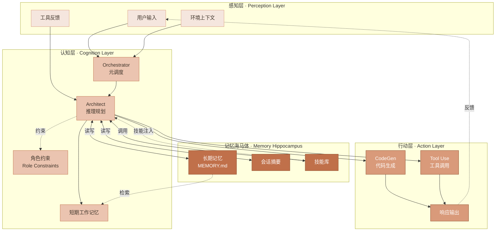

# 核心架构三维图

> 感知→认知→行动的层级关系，角色对推理的约束，以及记忆作为贯穿全流程的"海马体"

```mermaid
graph TB
    subgraph L1[感知层 · Perception Layer]
        S1[用户输入]
        S2[环境上下文]
        S3[工具反馈]
    end

    subgraph L2[认知层 · Cognition Layer]
        C1[Orchestrator<br/>元调度]
        C2[Architect<br/>推理规划]
        C3[角色约束<br/>Role Constraints]
        C4[短期工作记忆]
    end

    subgraph L3[行动层 · Action Layer]
        A1[CodeGen<br/>代码生成]
        A2[Tool Use<br/>工具调用]
        A3[响应输出]
    end

    subgraph MEM[记忆海马体 · Memory Hippocampus]
        M1[长期记忆<br/>MEMORY.md]
        M2[会话摘要]
        M3[技能库]
    end

    S1 --> C1
    S2 --> C1
    S3 --> C2

    C1 --> C2
    C2 -.约束.-> C3
    C2 --> C4

    C2 --> A1
    C2 --> A2
    A1 --> A3
    A2 --> A3

    C2 <-->|读写| M1
    C2 <-->|读写| M2
    C2 <-->|调用| M3

    A3 -.反馈.-> S1
    M1 -.检索.-> C4
    M3 -.技能注入.-> C2

    classDef perception fill:#F5E6DE,stroke:#D99A7A,color:#3F342A
    classDef cognition fill:#EBC4B0,stroke:#C0704A,color:#3F342A
    classDef action fill:#D99A7A,stroke:#8B4A2A,color:#FFFFFF
    classDef memory fill:#C0704A,stroke:#8B4A2A,color:#FFFFFF

    class S1,S2,S3 perception
    class C1,C2,C3,C4 cognition
    class A1,A2,A3 action
    class M1,M2,M3 memory
```
