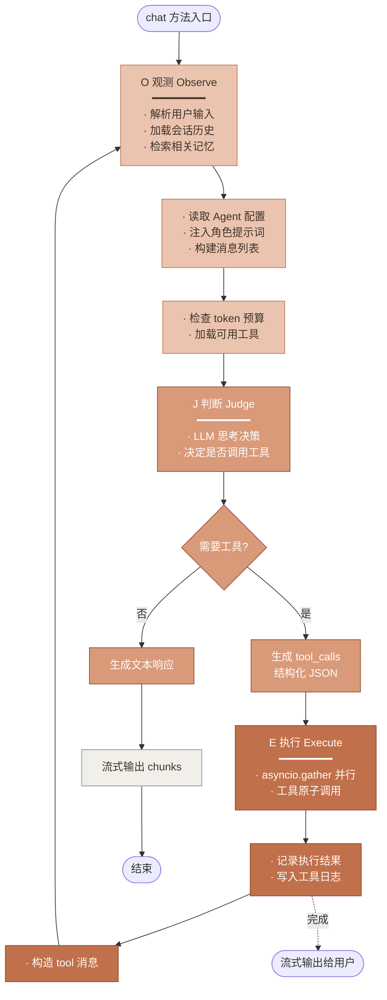

# OODA 工作流循环图

> `chat()` 方法内部严格的 观测→判断→执行 时序，突出每一步的原子性与可追踪性

```mermaid
flowchart TD
    Start([chat 方法入口]) --> O1[O 观测 Observe<br/>━━━━━━━━<br/>· 解析用户输入<br/>· 加载会话历史<br/>· 检索相关记忆]

    O1 --> O2[· 读取 Agent 配置<br/>· 注入角色提示词<br/>· 构建消息列表]
    O2 --> O3[· 检查 token 预算<br/>· 加载可用工具]

    O3 --> J1[J 判断 Judge<br/>━━━━━━━━<br/>· LLM 思考决策<br/>· 决定是否调用工具]

    J1 --> J2{需要工具?}
    J2 -->|是| J3[生成 tool_calls<br/>结构化 JSON]
    J2 -->|否| J5[生成文本响应]

    J3 --> E1[E 执行 Execute<br/>━━━━━━━━<br/>· asyncio.gather 并行<br/>· 工具原子调用]
    E1 --> E2[· 记录执行结果<br/>· 写入工具日志]
    E2 --> E3[· 构造 tool 消息]

    E3 --> O1
    E2 -.完成.-> End1([流式输出给用户])

    J5 --> Out1[流式输出 chunks]
    Out1 --> End2([结束])

    classDef observe fill:#EBC4B0,stroke:#C0704A,color:#3F342A
    classDef judge fill:#D99A7A,stroke:#8B4A2A,color:#FFFFFF
    classDef execute fill:#C0704A,stroke:#8B4A2A,color:#FFFFFF
    classDef decision fill:#F5E6DE,stroke:#D99A7A,color:#3F342A
    classDef output fill:#F0EFEA,stroke:#8D8B84,color:#3F342A

    class O1,O2,O3 observe
    class J1,J2,J3,J5 judge
    class E1,E2,E3 execute
    class Out1 output
```
