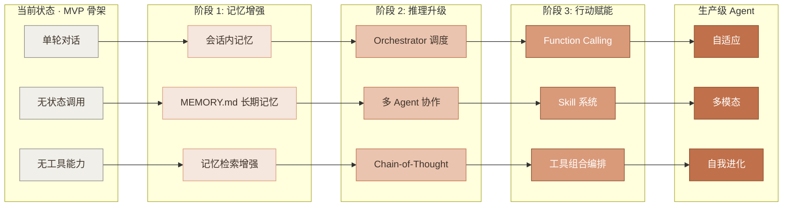

# 演化路径图

> 从当前最简骨架到生产级 Agent 的三个关键跨越方向：记忆增强、推理升级、行动赋能

```mermaid
graph LR
    subgraph Now[当前状态 · MVP 骨架]
        N1[单轮对话]
        N2[无状态调用]
        N3[无工具能力]
    end

    subgraph V1[阶段 1: 记忆增强]
        V1a[会话内记忆]
        V1b[MEMORY.md 长期记忆]
        V1c[记忆检索增强]
    end

    subgraph V2[阶段 2: 推理升级]
        V2a[Orchestrator 调度]
        V2b[多 Agent 协作]
        V2c[Chain-of-Thought]
    end

    subgraph V3[阶段 3: 行动赋能]
        V3a[Function Calling]
        V3b[Skill 系统]
        V3c[工具组合编排]
    end

    subgraph Future[生产级 Agent]
        F1[自适应]
        F2[多模态]
        F3[自我进化]
    end

    N1 --> V1a
    N2 --> V1b
    N3 --> V1c

    V1a --> V2a
    V1b --> V2b
    V1c --> V2c

    V2a --> V3a
    V2b --> V3b
    V2c --> V3c

    V3a --> F1
    V3b --> F2
    V3c --> F3

    classDef current fill:#F0EFEA,stroke:#8D8B84,color:#3F342A
    classDef memory fill:#F5E6DE,stroke:#D99A7A,color:#3F342A
    classDef reasoning fill:#EBC4B0,stroke:#C0704A,color:#3F342A
    classDef action fill:#D99A7A,stroke:#8B4A2A,color:#FFFFFF
    classDef future fill:#C0704A,stroke:#8B4A2A,color:#FFFFFF

    class N1,N2,N3 current
    class V1a,V1b,V1c memory
    class V2a,V2b,V2c reasoning
    class V3a,V3b,V3c action
    class F1,F2,F3 future
```
